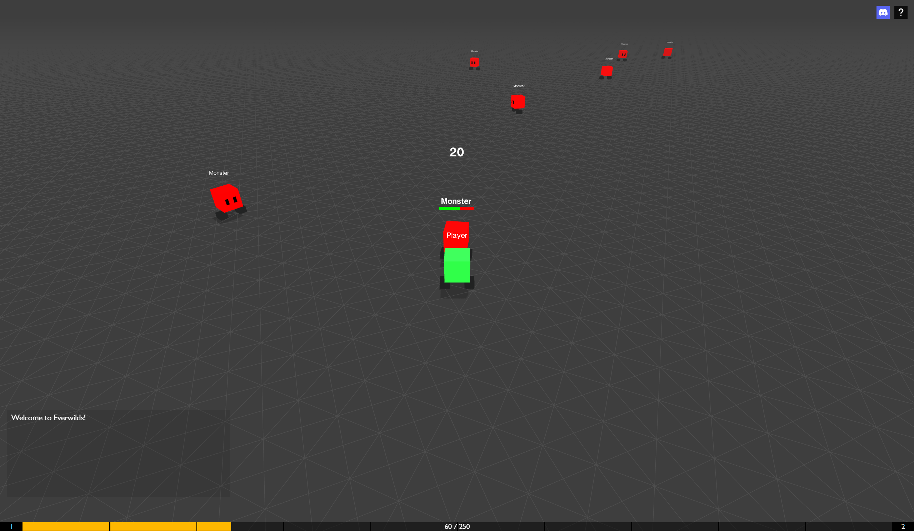

# [Everwilds](http://everwilds.io/)

Everwilds is a prototype and reference project that demonstrates how MMORPGs
like World of Warcraft are programmed, focusing primarily on networking and
netcode architecture. It serves as a learning resource for developers interested
in how real-time online RPGs handle networking, synchronization, and
client-server interaction.



> 🌟 If you find this project helpful or interesting, please consider giving it
> a star — it helps others discover it too!

## :blush: **Why?**

Ever since I was a kid playing the original Guild Wars and World of Warcraft,
I’ve wanted to learn how those kinds of games are made. That curiosity sparked
my interest in programming and game development. This project is the result of
deciding to dig deep into the architecture and technical foundations of
large-scale online games.

## 🧪 What's Included

While this is not a full MMORPG, it includes:

- A working client-server architecture
- Character movement with walk animation
- A basic combat system
- A simple leveling system (up to level 10)
- Ability to toggle character nameplates (by pressing v)
- A chat system

The highlight of this project is its approach to player movement synchronization
between clients. It uses the same technique used by World of Warcraft, enabling
smooth movement replication with minimal bandwidth usage, and allowing
scalability for many concurrent players. While the general method is publicly
known, implementing it correctly took a bit of research, trial and error, and
digging through obscure forums and private server codebases.

## :rocket: Technologies Used

- Three.js
- TypeScript
- HTML/CSS

## 🛠️ Installation

To run Everwilds locally execute the following commands in your terminal:

```bash
$ git clone https://github.com/nickyvanurk/everwilds
$ cd ./everwilds
$ npm i
$ npm run build
$ npm start
```

On Windows you have to manually copy the client/assets folder to the dist
folder, as the build command uses a Linux command that doesn't work on Windows.

If everything went well the game will be available at http://localhost:3000
